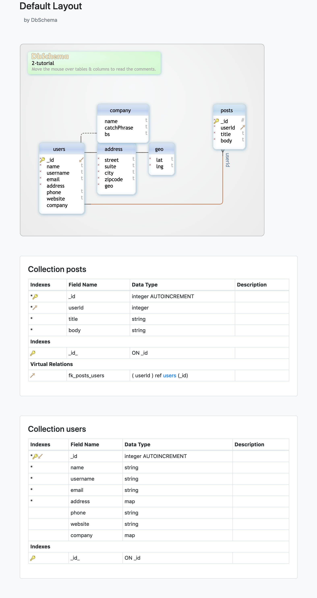
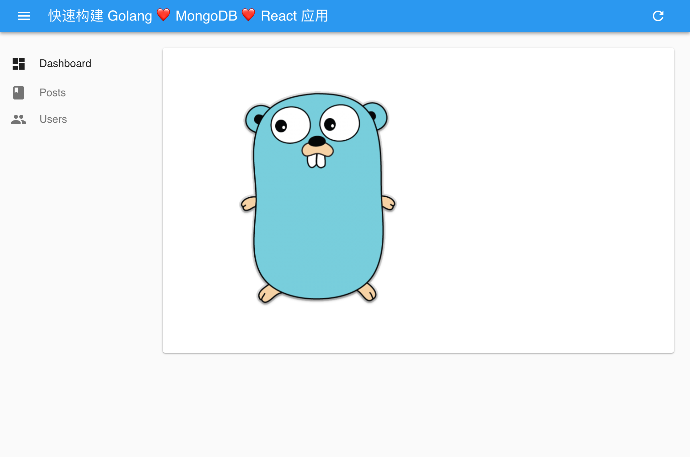
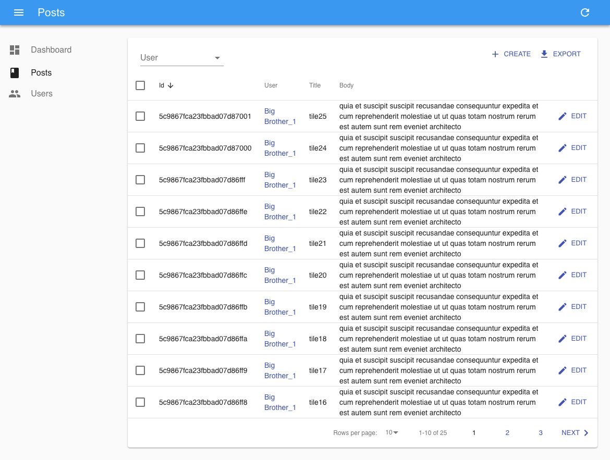

# Ten-Minutes-App

base on [golang](https://golang.org/) v1.12.x + [mongo-go-driver](https://github.com/mongodb/mongo-go-driver) v1.x + [gin](https://github.com/gin-gonic/gin) v1.3.x + [mongodb](https://www.mongodb.com/) v4.0.6 + [JSONPlaceholder](http://jsonplaceholder.typicode.com/), [react-admin](https://github.com/marmelab/react-admin)

[使用 Docker 一秒本地搭建 Mongodb&mongo-express 环境](https://github.com/Kirk-Wang/Hello-Gopher/tree/master/mongo)


App 介绍：

* 前端示例采用 Typescript 作为主要开发语言。
* 为什么选择 Typescript ? 相信 [这篇文章](https://juejin.im/post/59c46bc86fb9a00a4636f939) 会给你一些答案。
* 使用 [Create React App](https://facebook.github.io/create-react-app/) 快速生成脚手架（[Adding TypeScript
](https://facebook.github.io/create-react-app/docs/adding-typescript)）。
* [REST Client for Visual Studio Code](https://marketplace.visualstudio.com/items?itemName=humao.rest-client)。如果你用 VSCode，也许它比 Postman 更好用。
* 使用 [DbSchema](https://www.dbschema.com/)（请支持正版😝） 对数据进行可视化建模
  * [Demo](https://o-o.ren/scaling-redux-apps/visual-data-modeling/2-tutorial/)

<details>
  <summary>
    <b>10分钟内快速构建一个完整的应用</b>
  </summary>
  <ol>
    <li><a href="http://jsonplaceholder.typicode.com/users">Users</a>：路由导航，用户列表，分页，全选，删除（2s 可撤销删除），导出 CSV 文件，点击表头排序</li>
    <li><a href="http://jsonplaceholder.typicode.com/posts">Posts</a>：路由导航，文章列表，分页，全选，删除（2s 可撤销删除），导出 CSV 文件，点击表头排序</li>
    <li>添加文章（针对某个用户）</li>
    <li>编辑文章（2s 可撤销编辑）</li>
    <li>自定义首页（Dashboard）</li>
    <li>添加 AuthProvider（登录自定义处理，适配后端登录，注销功能）并设置登录页。</li>
    <li>添加 DataProvider（数据提供自定义处理，适配后端不同的 API 请求格式和响应）。</li>
  </ol>
</details>

<p align="center">

&nbsp;&nbsp;

&nbsp;&nbsp;

&nbsp;&nbsp;

&nbsp;&nbsp;

&nbsp;&nbsp;

&nbsp;&nbsp;

&nbsp;&nbsp;

&nbsp;&nbsp;

</p>







# Dev
```sh
# api
go run .
# app
cd app
yarn & yarn start
```

# Refs

* [mongo-go-dirver offical examples](https://github.com/mongodb/mongo-go-driver/blob/master/examples/documentation_examples/examples.go)
* [Go by Example](https://gobyexample.com/)
* [gotify/server](https://github.com/gotify/server)


# Q

* [Composite literal uses unkeyed fields](https://stackoverflow.com/questions/54548441/composite-literal-uses-unkeyed-fields)
* [Convert between int, int64 and string](https://yourbasic.org/golang/convert-int-to-string/)
